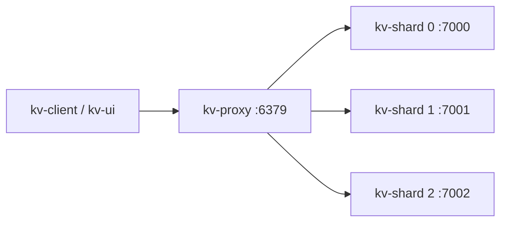

# ApexDB

An in-memory key-value store with a TCP client, hash-based sharding, sorted sets, and millisecond TTLs. The storage engine uses an incrementally rehashed table, an AVL tree for ordered members, and a min-heap for expiration. A `poll` event loop handles client connections; a worker pool disposes of large sorted sets.

This was a learning project, with automated tests for storage, data structures, protocol handling, and a live cluster. Data is held in memory and is lost on restart.

## Quick start

Requires a C++17 compiler. Python 3.8+ is required for integration tests. 

```sh
make -j4
make test
make integration
./bin/kv-server --port 6379
```

In another terminal:

```sh
./bin/kv-client set greeting hello
./bin/kv-client get greeting
./bin/kv-client incr visits
./bin/kv-client pexpire greeting 5000
./bin/kv-client pttl greeting
./bin/kv-client ping
```

The CLI accepts `-h HOST` and `-p PORT` **before** the command. Arguments after the command are treated literally. Exit status is 0 for successful responses (including nil) and 1 for command, connection, or protocol errors.

CMake is also supported:

```sh
cmake -S . -B build-cmake -DCMAKE_BUILD_TYPE=Release -DKV_BUILD_UI=OFF
cmake --build build-cmake -j4
ctest --test-dir build-cmake --output-on-failure
```

## Commands

Command names are lowercase and argument counts are exact. Keys and values are binary-safe on the wire. CLI output includes type labels such as `(str)` and `(int)`.

| Command | Result |
| --- | --- |
| `ping [message]` | `PONG`, or the supplied message |
| `set key value` | `OK`; replaces strings and clears their TTL; rejects sorted sets |
| `get key` | String value, or nil if absent |
| `del key` | 1 if a string or sorted set was removed, otherwise 0 |
| `exists key` | 1 if present, otherwise 0 |
| `type key` | `string`, `zset`, or `none` |
| `incr key` | Incremented signed 64-bit integer; creates absent keys at 1; preserves TTL |
| `pexpire key milliseconds` | 1 if present, otherwise 0; nonpositive durations delete immediately |
| `pttl key` | Remaining milliseconds; -1 for no expiry, -2 for absent keys |
| `persist key` | 1 if an expiry was removed, otherwise 0 |
| `keys` | Unordered array of all live keys across the cluster |
| `zadd key score member` | 1 for a new member, 0 for an updated score |
| `zrem key member` | 1 if removed, otherwise 0 |
| `zscore key member` | Double score, or nil |
| `zquery key score member offset limit` | Flat array of alternating members and scores |


```sh
./bin/kv-client zadd leaderboard 100 alice
./bin/kv-client zadd leaderboard 200 bob
./bin/kv-client zquery leaderboard -inf '' 0 10
```

## Cluster



Run each process in its own terminal:

```sh
./bin/kv-shard --id 0 --shards 3 --port 7000
./bin/kv-shard --id 1 --shards 3 --port 7001
./bin/kv-shard --id 2 --shards 3 --port 7002
./bin/kv-proxy --port 6379 --shard localhost:7000 --shard localhost:7001 --shard localhost:7002
```

Docker Compose runs three shards and a proxy with health checks:

```sh
docker compose up --build -d
docker compose exec proxy kv-client set greeting hello
docker compose exec proxy kv-client get greeting
docker compose down
```

Only the proxy port is published, on `127.0.0.1:6379`. Container processes run as a non-root user. SIGINT/SIGTERM close client sockets, drain deletion work, and stop cleanly.

## Protocol

This project uses its own binary protocol, **not Redis RESP**. All integers and doubles currently use native byte order and representation; peers must share compatible architectures. Strings are raw bytes.

- Request: `u32 body_length`, `u32 argument_count`, then repeated `u32 byte_length` + argument bytes.
- Response: `u32 body_length`, then one tagged value.
- Tags: 0 = nil; 1 = error (`u32 code`, `u32 length`, message); 2 = string (`u32 length`, bytes); 3 = signed `i64`; 4 = double; 5 = array (`u32 count`, tagged elements).
- Error codes: 1 = unknown command/routing failure; 2 = response too large; 3 = wrong type; 4 = invalid argument.
- Maximum body: 32 MiB; maximum argument count: 200,000. Oversized or malformed request frames close the connection. Oversized responses return an error.
- Multiple requests may be pipelined on one connection; responses retain request order. Idle connections close after roughly five seconds.

The current response contract replaces the earlier human-readable `CMD: (GET/SET/DEL)` strings. `set` clears TTL, and negative `pexpire` deletes; use `persist` to remove a TTL. The corrected FNV-1a hash also changes partition assignments compared with the earlier additive hash.

## Testing and development

```sh
make test
make integration
make -j4 BUILDDIR=build-sanitize BINDIR=bin-sanitize \
  CXXFLAGS='-std=c++17 -Wall -Wextra -Wpedantic -O1 -g -Iinclude -fsanitize=address,undefined -fno-omit-frame-pointer' \
  LDFLAGS='-pthread -fsanitize=address,undefined' all test
python3 tests/integration.py --bin-dir bin-sanitize
```

Five unit executables cover AVL invariants, heap indexing, routing/hash vectors, storage semantics/lifetime, and protocol validation. Integration tests start isolated processes on ephemeral ports and cover concurrency, TTL, binary values, fragmentation, pipelining, malformed frames, shard failure, and CLI exit codes. CI checks Make on Linux/macOS, CMake Release, Linux sanitizers, and Docker Compose.
